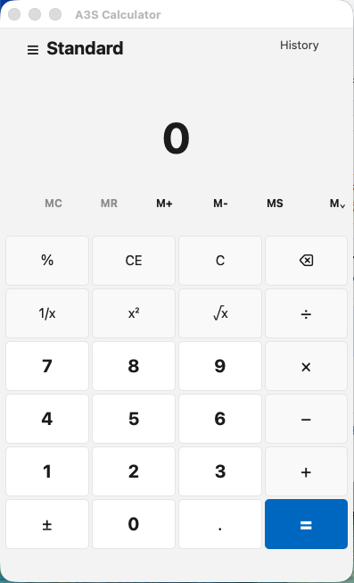

# A3S GUI

Native GUI runtime for structured A3S UI frames.

A3S GUI renders reducer-driven UI frames into native AppKit, WinUI, GTK4, or a
headless test host without embedding a browser. The primary authoring model is
React-aligned Rust function components stored in `.rsx` files and backed by
explicit `ComponentCx` hooks. Hooks own state selection, semantic props, and
reducers. Views consume hook handles and compose registered RSX components. A3S
lowers those components into a portable native IR, reconciles keyed updates, and
routes native events back to stable action ids.

React hook names map to Rust-native behavior: `use_reactive` and `use_selector`
expose render state, `use_reducer` handles native actions, `use_memo` derives
render data, `use_context` reads environment data, `use_ref` holds local mutable
handles, and insertion/layout/passive effect hooks run after a native frame is
committed. Legacy `use_state` remains as the selector spelling for existing
code. The React 19.2 hook set is tracked in the RSX docs, including native
variants for external stores, optimistic overlays, action state, and form
status.

## React Hook Parity

A3S GUI tracks the stable hook surface from React 19.2 and the React DOM
`useFormStatus` hook. The mapping is intentionally Rust-native: app state lives
in the application state `S`, reducers mutate that state through native action
ids, and effects run against committed native frames. React does not provide a
`use_reducer_effect` hook; reducer-scoped post-action work is modeled with
`use_action_effect`, `use_value_effect`, `use_payload_effect`, and transition
effect variants instead.

| React hook | A3S hook/API | Verification |
| --- | --- | --- |
| `useState` | `use_reactive`, `use_selector`, legacy `use_state` | Selector, reactive binding, and calculator tests. |
| `useReducer` | `use_reducer`, `use_value_reducer`, `use_payload_reducer` | Native action and calculator reducer tests. |
| `useContext` | `use_context` | Context selector tests. |
| `useRef` | `use_ref` | `component_cx_react_identity_and_debug_hooks_have_runtime_state`. |
| `useImperativeHandle` | `use_imperative_handle` | `component_cx_react_identity_and_debug_hooks_have_runtime_state`. |
| `useEffect` | `use_effect`, `use_effect_once`, `use_effect_with_deps` | `rsx_component_render_effect_phases_run_and_cleanup_in_react_order`. |
| `useLayoutEffect` | `use_layout_effect` variants | `rsx_component_render_effect_phases_run_and_cleanup_in_react_order`. |
| `useInsertionEffect` | `use_insertion_effect` variants | `rsx_component_render_effect_phases_run_and_cleanup_in_react_order`. |
| `useEffectEvent` | `use_effect_event` | `component_cx_use_effect_event_reads_latest_state_from_effects`. |
| `useMemo` | `use_memo`, `use_derived` | Derived and memo selector tests. |
| `useCallback` | `use_callback` | `component_cx_react_identity_and_debug_hooks_have_runtime_state`. |
| `useTransition` | `use_transition_reducer`, `use_transition_effect` | Transition reducer/effect tests. |
| `useDeferredValue` | `use_deferred_value` | `rsx_component_use_deferred_value_lags_one_committed_render`. |
| `useId` | `use_id` | `component_cx_react_identity_and_debug_hooks_have_runtime_state`. |
| `useDebugValue` | `use_debug_value`, `debug_values(state)` | `component_cx_react_identity_and_debug_hooks_have_runtime_state`. |
| `useSyncExternalStore` | `use_sync_external_store`, `SyncExternalStore` | `component_cx_use_sync_external_store_reads_snapshots_and_notifies_subscribers`. |
| `useOptimistic` | `use_optimistic` | `component_cx_use_optimistic_exposes_overlay_until_cleared`. |
| `useActionState` | `use_action_state` | `component_cx_use_action_state_and_form_status_track_action_results`. |
| React DOM `useFormStatus` | `use_form_status` | `component_cx_use_action_state_and_form_status_track_action_results`. |

React's `use` entry is an API, not part of the built-in hook list. The closest
native A3S shape is `use_resource`, which exposes resource status and data to
RSX under a stable path. See `docs/rsx.md` for the full hook contract and
examples.

For object-shaped state, `cx.use_reactive("profile", ...)` exposes a
serializable Rust object as a reactive RSX binding, so views can read nested
fields such as `{profile.name}` while reducers continue to mutate the real Rust
state.

It is not a WebView runtime. There is no DOM, CSSOM, browser layout engine, or
JavaScript object graph at the host boundary.

## Status

| Area | Readiness |
| --- | --- |
| Component authoring | Usable with Rust `ComponentCx` hooks, `.rsx` function components, component contracts, and native state bindings. |
| `rsx_ui` design system | Usable shadcn-like semantic component set backed by `DESIGN.md` tokens, React-style composition, and Rust-owned hooks. |
| Headless runtime | Usable for protocol tests, command inspection, reducer loops, and accessibility snapshots. |
| AppKit native surface | Usable for macOS smoke apps with windows, core controls, menus, keyboard events, close actions, and native `autoFocus`. |
| GTK4 native surface | Usable for Linux smoke apps with the same core controls, menus, dialogs, close actions, and scroll containers. |
| WinUI native surface | Usable for Windows smoke apps with core controls, size hints, resize bounds, focus callbacks, keyboard routing, close actions, and root-window exit. Programmatic `autoFocus` is tracked but limited by the current `winio-winui3` safe API. |
| Product app shell | Dogfood-ready. Production distribution still needs signed installers, broader native automation, and longer real-world focus/input hardening. |

## Available Semantic Components

`rsx_ui` components are registered automatically by the default component
registry. Application code imports and uses them directly in RSX; it does not
need `register_ui_*` or `install_ui_*` calls. Each component is implemented as
an `.rsx` function component under `src/rsx_ui/components/`, with behavior
hooked through `ComponentCx`.

The table below lists every semantic component currently registered by
`src/rsx_ui/components/registry/`.

| Registry | Components |
| --- | --- |
| Foundation | `UiLabel`, `UiText`, `UiDescription`, `UiHeading`, `UiLink`, `UiPressable`, `UiHoverable`, `UiKeyboardTarget`, `UiClipboardTarget`, `UiLongPressable`, `UiMovable`, `UiFocusable`, `UiFocusRing`, `UiFocusScope`, `UiI18nProvider`, `UiVisuallyHidden`, `UiSharedElement`, `UiSharedElementTransition`, `UiBreadcrumbs`, `UiBreadcrumb`, `UiTextarea`, `UiTextArea`, `UiCard`, `UiCardHeader`, `UiCardTitle`, `UiCardDescription`, `UiCardContent`, `UiCardFooter`, `UiBadge` |
| Controls | `UiButton`, `UiInput`, `UiTextField`, `UiSearchField`, `UiNumberField`, `UiDateField`, `UiDateInput`, `UiDateSegment`, `UiTimeField`, `UiForm`, `UiFieldError`, `UiFieldSet`, `UiLegend`, `UiCheckbox`, `UiCheckboxGroup`, `UiSwitch`, `UiRadioGroup`, `UiRadio` |
| Collections | `UiSelect`, `UiComboBox`, `UiAutocomplete`, `UiSelectValue`, `UiComboBoxValue`, `UiCollection`, `UiListBox`, `UiListBoxSection`, `UiListBoxHeader`, `UiListBoxItem`, `UiListBoxLoadMoreItem`, `UiGridList`, `UiGridListSection`, `UiGridListHeader`, `UiGridListItem`, `UiGridListLoadMoreItem`, `UiTagGroup`, `UiTagList`, `UiTag`, `UiTree`, `UiTreeSection`, `UiTreeHeader`, `UiTreeItem`, `UiTreeItemContent`, `UiTreeLoadMoreItem`, `UiMenu`, `UiMenuTrigger`, `UiMenuSection`, `UiSubmenuTrigger`, `UiMenuItem` |
| Data | `UiTable`, `UiTableHeader`, `UiTableBody`, `UiTableFooter`, `UiResizableTableContainer`, `UiTableRow`, `UiRow`, `UiTableColumn`, `UiColumn`, `UiColumnResizer`, `UiTableCell`, `UiCell`, `UiTableLoadMoreItem`, `UiTableCaption`, `UiTabs`, `UiTabsList`, `UiTabList`, `UiTabPanels`, `UiTabsTrigger`, `UiTab`, `UiTabsContent`, `UiTabPanel` |
| Date and time | `UiDatePicker`, `UiDateRangePicker`, `UiCalendar`, `UiRangeCalendar`, `UiCalendarHeading`, `UiCalendarGrid`, `UiCalendarGridHeader`, `UiCalendarGridBody`, `UiCalendarHeaderCell`, `UiCalendarCell`, `UiCalendarMonthPicker`, `UiCalendarYearPicker` |
| Color | `UiColorPicker`, `UiColorArea`, `UiColorThumb`, `UiColorField`, `UiColorSlider`, `UiColorWheel`, `UiColorWheelTrack`, `UiColorSwatch`, `UiColorSwatchPicker`, `UiColorSwatchPickerItem` |
| Commands | `UiToolbar`, `UiToggleButton`, `UiToggleButtonGroup`, `UiKeyboard`, `UiSelectionIndicator` |
| Routing | `UiRouter`, `UiRoutes`, `UiRoute`, `UiNavLink`, `UiNavigateButton` |
| Layout | `UiSeparator`, `UiMain`, `UiNavigation`, `UiHeader`, `UiFooter`, `UiSection`, `UiArticle`, `UiAside`, `UiSearch`, `UiGroup` |
| Overlays | `UiDialog`, `UiModal`, `UiModalOverlay`, `UiDisclosure`, `UiDisclosureGroup`, `UiDisclosureSummary`, `UiPopover`, `UiOverlayArrow`, `UiTooltip`, `UiTooltipTrigger`, `UiDialogTrigger`, `UiDisclosurePanel` |
| Range | `UiSlider`, `UiSliderTrack`, `UiSliderFill`, `UiSliderThumb`, `UiSliderOutput`, `UiProgressBar`, `UiMeter` |
| Feedback | `UiToastRegion`, `UiToast`, `UiVirtualizer` |
| Drag, drop, and files | `UiFileTrigger`, `UiDropZone`, `UiDraggable`, `UiDroppable`, `UiDropIndicator` |

These components lower to A3S semantic native roles where possible. Buttons,
text fields, selection controls, lists, menus, tables, tabs, dialogs, popovers,
tooltips, sliders, meters, progress bars, and landmarks carry typed native
role/state metadata in addition to their style classes.

## Design System

The built-in design system follows the current root `DESIGN.md`: quiet white
developer-tool surfaces, strong hairline borders, compact radii, black primary
actions, and blue only for inline/link semantics. Component defaults live in
`src/rsx_ui/classes.rs`; variant axes live in `src/rsx_ui/variants.rs`; color
tokens are resolved by `src/style/tailwind_utilities/values.rs`.

Use semantic components first, then customize them with `className`. The final
compiled class list is the component base class, selected variant classes,
selected size classes, and the caller `className`.

```rust
a3s_gui::rsx!(
    <div key="root" class="bg-canvas text-ink">
      <UiCard key="card" className="w-full">
        <UiCardHeader key="header">
          <UiCardTitle key="title">Settings</UiCardTitle>
          <UiCardDescription key="description">
            Native RSX controls
          </UiCardDescription>
        </UiCardHeader>
        <UiCardContent key="content">
          <UiInput
            key="email"
            value={state.email}
            placeholder="Email"
            onChange={setEmail}
          />
        </UiCardContent>
        <UiCardFooter key="footer">
          <UiButton
            key="save"
            variant="secondary"
            size="sm"
            className="w-full"
            onPress={saveProfile}
          >
            Save
          </UiButton>
        </UiCardFooter>
      </UiCard>
    </div>
)
```

### Component Variants

| Component | Supported variants and sizes |
| --- | --- |
| `UiButton` | `variant="default"`, `secondary`, `outline`, `ghost`, `link`, `destructive`; `size="default"`, `sm`, `lg`, `icon` |
| `UiBadge` | `variant="default"`, `secondary`, `destructive`, `outline` |

Unsupported variant values are rejected during render, so design-system drift is
visible in tests instead of silently producing mismatched UI.

### Theme Tokens

Use tokens through normal TailwindCSS color utility prefixes, for example
`bg-canvas`, `text-ink`, `border-hairline-strong`, `ring-ring`, and
`caret-ring`.

| Token family | Tokens |
| --- | --- |
| Canvas and surfaces | `background`, `canvas`, `card`, `popover`, `elevated`, `canvas-elevated`, `canvas-soft`, `surface-soft`, `canvas-softer`, `surface-strong`, `surface-pressed`, `surface-dark`, `surface-dark-elevated` |
| Text | `foreground`, `ink`, `body-strong`, `body`, `mute`, `faint`, `muted-foreground`, `muted-soft`, `on-dark`, `on-dark-mute`, `on-dark-soft` |
| Borders and focus | `border`, `hairline`, `hairline-soft`, `hairline-mid`, `hairline-strong`, `input`, `ring`, `charcoal` |
| Actions | `primary`, `primary-active`, `primary-foreground`, `secondary`, `secondary-foreground`, `accent`, `accent-foreground` |
| Status and links | `destructive`, `destructive-foreground`, `error`, `error-foreground`, `success`, `warning`, `preview`, `link`, `link-blue`, `text-link`, `link-deep`, `text-link-secondary`, `link-soft` |
| Charts and shell | `chart-1` through `chart-5`, `sidebar`, `sidebar-foreground`, `sidebar-primary`, `sidebar-primary-foreground`, `sidebar-accent`, `sidebar-accent-foreground`, `sidebar-border`, `sidebar-ring` |

### Built-In Contracts

| Pattern | Current contract |
| --- | --- |
| Primary action | `UiButton` default is `h-10`, `rounded-md`, black `bg-primary`, white `text-on-primary`, and `active:bg-primary-active`. |
| Secondary action | `UiButton variant="secondary"` uses `bg-canvas`, `text-ink`, and `border-hairline-strong`. |
| Inputs | `UiInput`, text fields, date/time fields, combo boxes, and text areas use a 44px height where applicable, `bg-canvas`, `rounded-md`, and `border-hairline-strong`. |
| Cards and panels | `UiCard`, dialogs, popovers, calendars, color pickers, toast rows, and framed data surfaces use `rounded-lg` and strong hairline borders. |
| Pills | Full pill geometry is reserved for `UiBadge` and naturally round controls such as switches, radios, slider thumbs, and color wheels. |
| Links | `UiLink` and `UiButton variant="link"` use `text-link`; blue is not used as a filled CTA color. |
| Routing | `UiRoute` conditionally renders from an `isActive` hook value. `UiNavLink` and `UiNavigateButton` send their `to` value through `actionValue` to the navigation reducer. |

### Routing Components

Use `UiRouter` components when a single RSX surface needs React Router-style
composition. Keep matching logic in hooks, then pass `isActive` into the view:

```rust
#[allow(non_snake_case)]
fn App(cx: &mut ComponentCx<AppState>) -> RSX {
    let currentPath = cx.use_state("currentPath", |state: &AppState| state.path.clone());
    let homeActive = cx.use_state("homeActive", |state: &AppState| state.path == "/");
    let settingsActive = cx.use_state("settingsActive", |state: &AppState| {
        state.path == "/settings"
    });
    let navigate = cx.use_reducer("navigate", |state: &mut AppState, action| {
        if let Some(path) = action.value() {
            state.path = path.to_string();
        }
        Ok(())
    });

    a3s_gui::rsx!(
        <UiRouter key="app" currentPath={currentPath}>
          <UiNavigation key="nav" label="Routes">
            <UiNavLink key="home" to="/" onNavigate={navigate} isActive={homeActive}>Home</UiNavLink>
            <UiNavigateButton key="settings" to="/settings" onNavigate={navigate} isActive={settingsActive}>Settings</UiNavigateButton>
          </UiNavigation>
          <UiRoutes key="routes" label="Application routes">
            <UiRoute key="home-route" path="/" isActive={homeActive}>
              <HomePage key="page" />
            </UiRoute>
            <UiRoute key="settings-route" path="/settings" isActive={settingsActive}>
              <SettingsPage key="page" />
            </UiRoute>
          </UiRoutes>
        </UiRouter>
    )
}
```

For route-level lifecycle hooks, route context, and separate page components,
use the lower-level `RsxRouter` described in `docs/rsx.md`.

## Tailwind Styling

A3S GUI uses TailwindCSS-compatible utilities as the primary styling surface for
RSX views. It does not require npm, Bun, the Tailwind CLI, browser CSS, CSSOM,
or a WebView. The Rust style resolver parses supported utility tokens into
`PortableStyle`, then each native backend maps that portable style to AppKit,
GTK4, WinUI, or the headless host.

Both `class` and `className` are accepted. First-party semantic components use
`className` for caller customization, matching the React and shadcn authoring
shape.

```rust
a3s_gui::rsx!(
    <UiButton
      key="run"
      variant="outline"
      size="lg"
      className="w-full justify-start border-hairline-strong bg-canvas text-ink active:bg-surface-strong"
      onPress={runCommand}
    >
      Run command
    </UiButton>
)
```

Arbitrary values are supported for native views that need exact sizing or
platform-matched color. The calculator dogfood app uses this path to mimic the
Windows Calculator layout:

```rust
a3s_gui::rsx!(
    <Button
      key="root"
      label={label}
      onPress={onPress}
      actionValue={actionValue}
      class="h-14 min-h-14 w-[94px] min-w-[94px] rounded-[5px] border border-[#e5e5e5] p-0 text-[#1b1b1b]"
      className={props.className}
    />
)
```

Supported utility families include:

| Family | Examples |
| --- | --- |
| Layout and sizing | `flex`, `inline-flex`, `grid`, `w-full`, `h-10`, `min-w-0`, `max-w-md`, `size-10`, `aspect-[4/3]` |
| Spacing and alignment | `p-4`, `px-[18px]`, `gap-2`, `items-center`, `justify-between`, `shrink-0` |
| Typography | `text-sm`, `text-[20px]`, `font-medium`, `leading-none`, `whitespace-nowrap`, `underline`, `tracking-[0.08em]` |
| Color and opacity | `bg-canvas`, `text-ink`, `border-hairline`, `ring-ring/50`, `bg-[#0067c0]`, `text-white`, `opacity-50` |
| Borders and effects | `border`, `rounded-md`, `rounded-[5px]`, `shadow-sm`, `outline-none`, `focus-visible:ring-[3px]` |
| State and selector variants | `active:*`, `disabled:*`, `focus-visible:*`, `placeholder:*`, `selection:*`, `file:*`, `aria-invalid:*`, `data-[selected=true]:*`, `has-[>svg]:*`, `[&_svg]:*` |
| Motion and media tokens | `transition-colors`, `duration-150`, `transform-*`, `filter-*`, `scrollbar-*`, responsive/container markers such as `md:*` and `@container/*` |

Normal TailwindCSS conflict rules are approximated by class order. Important
tokens such as `!bg-primary` are applied after normal tokens. Native backend
support for a parsed property can vary by platform, so portable product UI
should prefer the tested design-system tokens and component variants first.

To customize UI style at the right layer:

| Scope | Use |
| --- | --- |
| One view | Add or change `className` in the `.rsx` component. |
| One component family | Add a semantic prop or variant axis in `src/rsx_ui/variants.rs`, then consume it from the component `.rsx`. |
| Global visual language | Change token aliases in `src/style/tailwind_utilities/values.rs` and base contracts in `src/rsx_ui/classes.rs`. |
| App-specific exact match | Use arbitrary values such as `w-[396px]`, `bg-[#f3f3f3]`, and `font-[Segoe_UI,Inter,-apple-system,system-ui,sans-serif]`. |

Inline `style` remains available for low-level protocol compatibility, but
first-party components and examples should prefer `className` so the visual
language stays tokenized, grepable, and close to the shadcn/Tailwind authoring
model.

## Install

```toml
[dependencies]
a3s-gui = { git = "https://github.com/A3S-Lab/GUI" }
```

## RSX Usage

The current dogfood path is the calculator example under
`examples/support/calculator/`. It is split into real `.rsx` function
components. The root component owns application hooks; child components receive
hook data and action handles through props.

Current component files:

```text
examples/support/calculator/
|-- model.rs
|-- view.rs
`-- components/
    |-- calculator.rsx
    |-- shell.rsx
    |-- display.rsx
    |-- memory_bar.rsx
    |-- keypad.rsx
    |-- edit_row.rsx
    |-- function_row.rsx
    |-- seven_row.rsx
    |-- four_row.rsx
    |-- one_row.rsx
    |-- zero_row.rsx
    |-- keypad_row.rsx
    `-- button.rsx
```

`examples/support/calculator/components/calculator.rsx`:

```rust
use a3s_gui::{ComponentCx, RSX};
use serde::Serialize;

use super::super::model::CalculatorState;

#[derive(Debug, Clone, PartialEq, Serialize)]
#[serde(rename_all = "camelCase")]
struct CalculatorReactiveState {
    display: String,
    history: String,
    has_error: bool,
}

#[allow(non_snake_case)]
pub fn calculator(cx: &mut ComponentCx<CalculatorState>) -> RSX {
    let calculator = cx.use_reactive("calculator", |state: &CalculatorState| {
        CalculatorReactiveState {
            display: state.display().to_string(),
            history: state.history().to_string(),
            has_error: state.has_error(),
        }
    });

    let pressDigit = cx.use_value_reducer("pressDigit", |state: &mut CalculatorState, digit| {
        state.press_digit(digit)
    });
    let pressOperator =
        cx.use_value_reducer("pressOperator", |state: &mut CalculatorState, operator| {
            state.press_operator(operator)
        });
    let pressDecimal = cx.use_reducer("pressDecimal", |state: &mut CalculatorState, _| {
        state.press_decimal();
        Ok(())
    });
    let pressEquals = cx.use_reducer("pressEquals", |state: &mut CalculatorState, _| {
        state.press_equals()
    });
    let clear = cx.use_reducer("clear", |state: &mut CalculatorState, _| {
        state.clear();
        Ok(())
    });
    let clearEntry = cx.use_reducer("clearEntry", |state: &mut CalculatorState, _| {
        state.clear_entry();
        Ok(())
    });
    let backspace = cx.use_reducer("backspace", |state: &mut CalculatorState, _| {
        state.backspace();
        Ok(())
    });
    let percent = cx.use_reducer("percent", |state: &mut CalculatorState, _| state.percent());
    let reciprocal = cx.use_reducer("reciprocal", |state: &mut CalculatorState, _| {
        state.reciprocal()
    });
    let square = cx.use_reducer("square", |state: &mut CalculatorState, _| state.square());
    let squareRoot = cx.use_reducer("squareRoot", |state: &mut CalculatorState, _| {
        state.square_root()
    });
    let toggleSign = cx.use_reducer("toggleSign", |state: &mut CalculatorState, _| {
        state.toggle_sign();
        Ok(())
    });

    a3s_gui::rsx!(
        <CalculatorShell
            key="calculator"
            display={calculator.display}
            history={calculator.history}
            hasError={calculator.hasError}
            pressDigit={pressDigit}
            pressOperator={pressOperator}
            pressDecimal={pressDecimal}
            pressEquals={pressEquals}
            clear={clear}
            clearEntry={clearEntry}
            backspace={backspace}
            percent={percent}
            reciprocal={reciprocal}
            square={square}
            squareRoot={squareRoot}
            toggleSign={toggleSign}
        />
    )
}
```

`ActionHandle` values can be passed through component props, so child components
do not need to hard-code action ids.

`examples/support/calculator/components/button.rsx`:

```rust
use a3s_gui::{ComponentCx, RSX};

#[derive(Debug, Clone, PartialEq, Default)]
pub struct CalculatorButtonProps {
    pub label: String,
    pub on_press: String,
    pub action_value: String,
    pub class_name: String,
}

#[allow(non_snake_case)]
pub fn calculator_button(cx: &mut ComponentCx<CalculatorButtonProps>) -> RSX {
    let label = cx.use_prop("label", |props: &CalculatorButtonProps| props.label.clone());
    let onPress = cx.use_prop("onPress", |props: &CalculatorButtonProps| {
        props.on_press.clone()
    });
    let actionValue = cx.use_prop("actionValue", |props: &CalculatorButtonProps| {
        props.action_value.clone()
    });
    let className = cx.use_prop("className", |props: &CalculatorButtonProps| {
        props.class_name.clone()
    });

    a3s_gui::rsx!(
        <Button
            key="root"
            label={label}
            onPress={onPress}
            actionValue={actionValue}
            class="h-14 min-h-14 w-[94px] min-w-[94px] rounded-[5px] border border-[#e5e5e5] p-0 text-[#1b1b1b]"
            className={className}
        />
    )
}
```

`examples/support/calculator/view.rs` compiles the component and attaches native
window options:

```rust
use a3s_gui::{ComponentCx, GuiResult, RsxComponent, WindowOptions};

use super::{components, model::CalculatorState};

pub fn calculator_component(
    frame_id: &str,
    title: &str,
) -> GuiResult<RsxComponent<CalculatorState>> {
    Ok(ComponentCx::compile(frame_id, components::calculator)?
        .try_register(components::with_calculator_components)?
        .with_window(WindowOptions {
            title: title.to_string(),
            on_close: None,
            width: Some(410.0),
            height: Some(620.0),
            min_width: Some(360.0),
            min_height: Some(560.0),
            max_width: None,
            max_height: None,
            resizable: true,
        }))
}
```

`parse_rsx` parses A3S RSX in-process, with no Node, Bun, React, DOM, CSSOM, or
WebView runtime. Static elements, fragments, string/boolean/number literal
attributes, text children, event action references, `class` / `className`,
Tailwind-compatible values, component props, slots, and Rust-style
`ComponentCx` function components are supported. Arbitrary dynamic JavaScript
expressions are rejected unless they are represented as explicit A3S bindings or
event action identifiers.

## Examples

### RSX Calculator

The calculator example is a Windows Calculator-inspired native app authored as
split RSX function components under `examples/support/calculator/components/`
with Tailwind-compatible `className` utilities. The root calculator component
registers `ComponentCx` state and reducer hooks, while display, memory, keypad,
row, and button components compose the view.



From the monorepo root, run:

```bash
just calculator
```

Run protocol and reducer examples from this crate directory:

```bash
cargo run --example protocol_session
cargo run --example state_loop
cargo run --example native_runtime_app
cargo run --example dogfood_session
```

Run native smoke apps on the matching operating system:

```bash
# macOS
cargo run --features appkit-native --example appkit_controls
cargo run --features appkit-native --example appkit_dogfood

# Linux
cargo run --features gtk4-native --example gtk4_controls
cargo run --features gtk4-native --example gtk4_dogfood

# Windows
cargo run --features winui-native --example winui_controls
cargo run --features winui-native --example winui_dogfood
```

The shared dogfood app exercises windows, menus, dialogs, text input, number
input, initial/rerendered and change-event max-length clamping, focus/blur
routing, toggles, sliders, selects, tabs, keyboard shortcut routing, scroll
containers, window and dialog close actions, reducer-driven rerendering, and
state-driven app loop exit.

## Features

| Feature | Description |
| --- | --- |
| `headless` | Pure Rust host for tests and protocol validation. Enabled by default. |
| `appkit` | AppKit planning adapter and handle types. |
| `winui` | WinUI planning adapter and handle types. |
| `gtk4` | GTK4 planning adapter and handle types. |
| `appkit-native` | Native AppKit surface on macOS. |
| `winui-native` | Native WinUI surface on Windows. |
| `gtk4-native` | Native GTK4 surface on Linux. Requires GTK4 development libraries and `pkg-config`. |

## Development

Run the full local verification suite from `crates/gui`:

```bash
just verify
```

CI runs the same verification gate on Linux and also runs host-native AppKit,
GTK4, and WinUI compile/dogfood checks on their matching operating systems.
Pushes to `main` additionally stage and validate the unsigned dogfood bundles.
Those bundle smoke jobs upload compressed `a3s-gui-dogfood-*` artifacts for
manual download and platform QA, plus `.sha256` and `.metadata.txt` files for
archive integrity checks and artifact identification before unpacking. CI
validates that the archive, checksum file, and metadata agree before upload.

Focused native and dogfood checks:

```bash
just dogfood-regression
just check-native
just dogfood-native
```

Build and stage host-native dogfood release artifacts:

```bash
just release-native
just bundle-native
just check-bundle-native
```

The staged bundles are unsigned smoke artifacts. Product repositories still own
bundle identifiers, icons, signing, notarization, installers, update metadata,
and target-platform QA. Each staged dogfood bundle includes a `README.txt`
handoff note and a `MANIFEST.txt` with per-file SHA-256 checksums.

## Documentation

- [Architecture](docs/architecture.md)
- [RSX language](docs/rsx.md)
- [RSX framework plan](docs/rsx-framework.md)
- [Native app shell](docs/app-shell.md)
- [Native packaging](docs/packaging.md)

## License

MIT. See [LICENSE](LICENSE).
