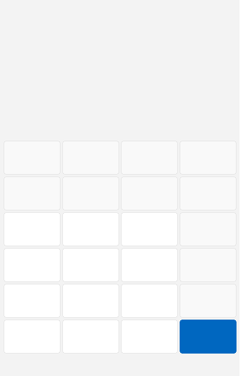

<p align="center">
  
</p>

<p align="center">
  <a href="https://github.com/A3S-Lab/GUI/actions/workflows/ci.yml"></a>
  
  
  
  <a href="LICENSE"></a>
</p>

**A3S GUI** is a Rust-native semantic UI and self-drawn rendering runtime.
Rust RSX works today, and the private `@a3s/gui` automatic JSX runtime lowers
standard TSX into the same versioned frame protocol. Neither authoring path
uses a DOM, CSSOM, WebView, or platform content-widget toolkit.

> [!IMPORTANT]
> A3S owns every application-content pixel. The former AppKit, GTK4, and WinUI
> content backends, features, dependencies, examples, packaging scripts, and CI
> lanes have been deleted. `platform-host` defines the zero-widget boundary,
> `platform-runtime` implements the shared atomic self-drawn frame runtime, and
> `host-windows` provides the first raw Win32 window lifecycle, owned surface
> lease, and normalized mouse/keyboard/wheel/touch/pen input. The Graphics-owned
> presenter submits, presents, and can capture the exact prepared DX12
> swapchain frame. Raw macOS/Linux hosts remain roadmap work.

## One semantic tree, one owned-pixel pipeline

```text
Rust ComponentCx / .rsx           TypeScript / TSX
            |                           |
            |                  @a3s/gui/jsx-runtime
            +-------------+-------------+
                          |
                          v
                 versioned UI frame
                          |
                          v
                   NativeElement tree
                 /          |           \
                v           v            v
       layout snapshot  accessibility  interaction + hit regions
                |                         |
                +------------+------------+
                             v
                    A3S Graphics Scene
                             |
                 +-----------+-----------+
                 v                       v
       deterministic software          wgpu
                                         |
                              Metal / DX12 / Vulkan
                                         |
                              zero-widget OS surface
```

Semantic identity is shared across layout, hit testing, accessibility, focus,
selection, and rendering. Paint commands never become the accessibility tree,
and Graphics never infers behavior from pixels.

| Layer | Owns | Explicitly does not own |
| --- | --- | --- |
| Authoring | Rust components/RSX; automatic TSX elements and callbacks | OS handles, GPU resources, layout truth |
| Semantic runtime | Roles, props, actions, focus, selection, overlays, i18n, drag/drop, accessibility | Platform widgets, toolkit layout, product I/O |
| Layout and scene | Portable style, quantized boxes, stable paths, hit regions, scene extraction | Product state or OS geometry |
| [A3S Graphics](https://github.com/A3S-Lab/Graphics) | Retained scenes, damage, software reference output, GPU surfaces, preparation, rendering, and presentation | Components, windows, IME, accessibility |
| Platform boundary | Native windows, owned surface-lifetime targets, commit coordination, normalized input, text/IME, accessibility bridge, clipboard and system services | Application-content controls, styling, layout, or drawing |

Read [Architecture](docs/architecture.md) and
[Self-drawn platform hosts](docs/platform-hosts.md) for the contracts.

## Current DX12 evidence

<p align="center">
  
</p>

This is the exact prepared swapchain image from the canonical TSX calculator,
not a browser or toolkit mock. The same model produces byte-identical software
output from Rust RSX; the reviewed DX12 run differs at 940 of 254,200 pixels
(0.370%) with a maximum channel delta of 91. The
[capture manifest](docs/assets/calculator-tsx-dx12.json) pins the evidence.
Labels are intentionally absent because the production font/shaping/glyph
backend is the next renderer milestone.

## Current implementation

The repository already provides:

- a stable `NativeElement` semantic IR and strict versioned frame protocols;
- Rust RSX parsing, components, hooks, reducers, effects, and a built-in
  semantic component catalog;
- focus, interaction, overlays, selection, collection navigation, i18n,
  drag/drop policy, live regions, and accessibility snapshots;
- portable style resolution across all 504 top-level `PortableStyle` fields;
- deterministic layout snapshots, stable scene identity, software reference
  output, retained damage, canonical RSX/TSX calculator parity, and reviewed
  offscreen plus exact native-surface DX12 evidence;
- explicit production text boundaries: a bounded `TextShaper` produces the
  only intrinsic measurement and retained glyph record, password values are
  masked before shaping, and a stateful `TextSceneEncoder` consumes that same
  record without receiving source text or escaping its ink bounds;
- a bounded `PlatformHost` transaction/event contract with dependency
  firewalls;
- a target-gated `WindowsPlatformHost` with real Win32 `HWND` lifecycle,
  per-monitor-v2 DPI client sizing, message pumping, focus/close/occlusion
  events, DPI-correct legacy mouse/keyboard/wheel translation, capture and
  focus-loss cancellation, bounded concurrent `WM_POINTER` touch/pen
  translation with pressure and namespaced identities, real-HWND touch and
  User32 synthetic-pen injection evidence, compatibility-mouse suppression,
  barrel-button normalization, geometry-before-exposure minimize/restore
  recovery, native-resize transaction reconciliation, hidden first-frame
  staging, owned raw-surface leases that prevent premature HWND destruction,
  atomic
  prepare/commit/rollback, and Windows-native CI evidence;
- `SelfDrawnWindowRuntime` with atomic prepare/commit/reject, recovery,
  typed presentation outcomes, normalized input, hit testing, drag/drop,
  accessibility actions, retained redraw retry, and reference/recording/GPU
  presenters; the TSX event pump attempts at most one pending recovery per turn;
- a real Windows presentation gate that prepares a Graphics swapchain frame
  against the staged HWND, commits and shows the raw window, presents through
  DX12, verifies the submitted scene fingerprint, destroys the attached device
  through an explicit fault-injection feature, recreates the device and surface,
  and releases the GPU surface before destroying the HWND;
- a one-shot presenter capture contract that copies the exact prepared
  swapchain texture before presentation, normalizes BGRA to RGBA, and compares
  the visible TSX calculator against the shared deterministic RSX/TSX scene in
  target-native CI;
- Rust-generated TypeScript protocol declarations, canonical cross-language
  fixtures, automatic JSX lowering, strict frame normalization, and
  revision-scoped ordered callbacks;
- a transport-neutral TypeScript `createApp` lifecycle with keyed component
  instances, typed context, render error boundaries, state/reducer/memo/ref/
  effect hooks, batched rerenders, post-commit cleanup, and strict post-handshake
  session/message identity;
- a finalized TSX identity contract: Node-local component instances use
  canonical `a3s:c1:` identities, automatic actions use canonical `a3s:a1:`
  ids derived only from native key paths plus event names, and the generated
  `a3s:` namespace cannot be claimed by explicit actions; Rust owns and
  validates the constants at the Host boundary and generates their TypeScript
  declarations;
- a dependency-free TypeScript client handshake and incremental little-endian
  JSON frame codec aligned with the Rust protocol boundary;
- an ordered framed connection and explicit no-shell Node child-process byte
  transport with bounded stderr, shutdown timeout, and real process fixtures.
- `a3s-gui-tsx-host`, a strict framed stdin/stdout process that negotiates one
  TSX session and lowers full frames into `NativeElement`. A Windows product
  build selects `WindowsPlatformHost + GpuScenePresenter`, opens a visible raw
  HWND, presents through Graphics/DX12, continuously pumps normalized input,
  returns ordered TSX actions (including window close), and accepts monotonic
  host revisions after redraw/resize. The software-reference build remains a
  deterministic process-test facility rather than an alternate product host.
- `A3sFramedApplicationHostV1`, an ordered single-reader application pump that
  shares the negotiated client session with `createApp`, bounds outstanding
  event work and host-message reordering, answers host pings across pending
  commit/event application, performs timeout-bounded client ping/pong and
  close/ack control, propagates fatal/stream failures, and is exercised from
  real Node through the Rust software host.
- the hostless `createApp(App).run()` path, which selects a validated
  platform host artifact, creates a unique protocol session, binds native events
  before the first render, and closes a partially started host on failure.
- opt-in bounded Host supervision, which observes abnormal termination,
  negotiates a fresh session, transactionally replays the last committed full
  frame and callback scope, gates events until replay commits, and closes the
  application after the configured restart budget is exhausted;
- a real three-generation child-process gate that crashes the first Host,
  accepts keyboard activation after replay, rejects an older render revision
  without invoking its callback, and replays again into a fresh session.

Still required before a production native application:

- Windows hardware-device pen capture plus tilt/rotation/eraser conformance,
  TSF, UI Automation, and system services;
- real zero-widget macOS and Wayland/X11 hosts;
- a production font database/shaper and glyph raster/atlas encoder, followed by
  text editing, IME, and assistive-technology bridges;
- packaging, signing, installer work, and tri-platform visual evidence;
- full self-drawn conformance evidence for every React Aria family.

The nonvisual `HeadlessAdapter` remains only as protocol and transaction test
infrastructure. It is not a renderer and always emits the diagnostic class
`a3s_gui::HeadlessNode`.

## Complete React Aria scope

The target is every semantic family in the official
[React Aria](https://react-aria.adobe.com/) catalog. The checked-in
[component matrix](docs/react-aria-component-matrix.json) pins
`react-aria-components` 1.19.0 and is schema-tested in CI.

- All 51 official top-level families have an explicit A3S component mapping.
- `Button` has the first scene/software-pixel smoke evidence.
- No family is marked self-drawn conformant yet.
- A family becomes conformant only after authoring, behavior, layout/hit,
  scene, deterministic pixels, accessibility, and real macOS/Windows/Linux
  host evidence all pass.

See [React Aria self-drawn direction](docs/react-aria-native.md) for the
acceptance contract and known API gaps.

## TSX without a browser

The TypeScript design adopts
[Nub](https://github.com/nubjs/nub)'s useful boundary: stock Node loads normal
TSX, while a narrow Rust process owns semantic reconciliation, layout,
rendering, and OS resources.

```tsx
import { Button, Text, View, Window, createApp, useState } from "@a3s/gui";

function Counter() {
  const [count, setCount] = useState(0);
  return (
    <Window title="Counter" width={360} height={220}>
      <View className="flex-col gap-4 p-6">
        <Text>Count: {count}</Text>
        <Button onPress={() => setCount((value) => value + 1)}>
          Increment
        </Button>
      </View>
    </Window>
  );
}

await createApp(Counter).run();
```

This zero-argument startup API is implemented and exercised from Node against
the deterministic Rust software/self-drawn test process. It resolves the exact
platform artifact package and validates its manifest, size, target, protocol range, and
SHA-256 checksum before spawn; the repository test path uses an explicit
absolute development artifact override plus an unverified-Host opt-in.
The Windows target lane now drives the same protocol through a visible raw HWND,
Graphics/DX12 presentation, Win32 mouse input, and semantic window-close action.
Published native packages, reviewed visual parity, accessibility/IME completion,
and macOS/Linux hosts do not exist yet, so this is still not an end-user native
package. The underlying scheduler also
remains usable with a typed host object. It owns keyed function-component
instances, typed nested context, render error boundaries, state/reducer/memo/
ref/effect hooks, one-microtask rerender batching, revision-scoped callbacks,
effect promotion only after `committed`, full render envelopes, independent
client/host message ordering, client `hello`/`welcome` negotiation, bounded
incremental framing, an explicit Node child-process transport, the strict
`a3s-gui-tsx-host` self-drawn process, and an ordered framed
application host shared with `createApp`, including bidirectional ping/pong,
fixed host liveness deadlines, protocol-level graceful close, and opt-in
bounded restart/replay supervision over fresh protocol sessions. Completing
the native services and parity gates, platform artifact publication, and npm
publication remain T3-T5 work.

Read [TSX native runtime](docs/tsx-native-runtime.md) for protocol and delivery
gates.

## Rust RSX quick start

Consume the crate from Git:

```toml
[dependencies]
a3s-gui = { git = "https://github.com/A3S-Lab/GUI" }
```

Define state, register a reducer, and return semantic RSX:

```rust
use a3s_gui::{rsx, ComponentCx, GuiResult, RSX};

#[derive(Default)]
struct CounterState {
    count: u32,
}

fn counter(cx: &mut ComponentCx<CounterState>) -> RSX {
    let count = cx.use_state("count", |state: &CounterState| state.count);
    let increment = cx.use_reducer("increment", |state: &mut CounterState, _| {
        state.count += 1;
        Ok(())
    });

    rsx!(
        <Button key="increment" onPress={increment}>
          Count {count}
        </Button>
    )
}

fn main() -> GuiResult<()> {
    let component = ComponentCx::compile("counter", counter)?;
    let frame = component.render(&CounterState::default())?;
    println!("{} action(s)", frame.actions.len());
    Ok(())
}
```

Run maintained examples:

```sh
cargo run --locked --example component_playground
cargo run --locked --example dogfood_session
cargo run --locked --no-default-features \
  --features authoring,platform-runtime,software-reference \
  --example self_drawn_calculator
```

## Cargo features

| Feature | Purpose |
| --- | --- |
| `default` | `authoring + design-system + software-reference` |
| `authoring` | SWC-backed Rust RSX parsing and compilation |
| `design-system` | Built-in semantic component registrations |
| `graphics` | GUI-to-A3S-Graphics scene boundary |
| `software-reference` | Deterministic software presenter |
| `gpu` | Graphics-owned offscreen and native-surface GPU paths |
| `gpu-fault-injection` | Explicit conformance-only device destruction; never enabled by default |
| `platform-host` | Zero-widget OS boundary contracts and recording host |
| `platform-runtime` | Shared self-drawn frame/input/accessibility runtime |
| `host-windows` | Raw Win32 top-level host, owned `HWND` surface target, and normalized legacy input; no WinUI/XAML |
| `host-macos`, `host-linux-*` | Zero-widget host capability markers; concrete hosts are not implemented yet |
| `typescript-schema` | Rust-to-TypeScript protocol declaration generation |

There are deliberately no AppKit, GTK4, WinUI, or corresponding
content-toolkit feature flags.

## Development

The full CI-equivalent gate is:

```sh
just verify
```

Useful focused gates:

```sh
just check-core
just check-platform-host
just check-platform-runtime
just test-platform-host
just test-platform-runtime
just test-windows-host # Windows only
just test-graphics
just check-tsx-protocol
just test-typescript
just test-tsx-host
```

`just verify` also checks dependency firewalls, formatting, Clippy, rustdoc,
all Rust tests and examples, the React Aria catalog, TypeScript fixtures, and
whitespace. CI adds Windows-native lifecycle and minimize/restore ordering,
touch/pen system injection, input/cancellation, H1 transaction, real DX12
presentation, exact calculator swapchain capture parity, and device-loss
recreation evidence.
Toolkit-specific content-host and legacy bundle lanes do not exist.

## Repository map

```text
src/
|- compiler/              RSX/intrinsic lowering into semantic IR
|- runtime/               reconciliation, focus, interaction, selection
|- layout/                deterministic layout snapshots and hit regions
|- drawing/               semantic/layout to A3S Graphics scenes
|- platform_host/         zero-widget contracts, recording host, raw Win32 host
|- platform_runtime/      shared atomic self-drawn window runtime
|- tsx_protocol/          strict Node/Rust wire protocol
|- bin/tsx_host.rs        TSX process/session entry point
|- bin/tsx_host/          native/test backend selection and event pump
|- semantic_ui/           React Aria-aligned semantic components and hooks
`- platform/              nonvisual planning/transaction test IR
packages/typescript/      private automatic JSX runtime and protocol SDK
tests/                    dependency firewalls and catalog gates
docs/                     architecture, roadmap, protocol, and conformance
```

## Roadmap

The next critical path is:

1. implement the font discovery/shaping and glyph raster/atlas backends on the
   landed generic text contracts, then add editing and IME;
2. add hardware-device pen capture and tilt/rotation/eraser semantics, TSF,
   UI Automation, and system services on Windows;
3. port the same zero-widget capture contract to macOS and Wayland/X11;
4. close React Aria families milestone by milestone with tri-platform evidence;
5. restore packaging only after the self-drawn host artifacts exist.

The versioned plan lives in [ROADMAP](docs/roadmap.md).

## Documentation

- [Architecture](docs/architecture.md)
- [Roadmap](docs/roadmap.md)
- [Self-drawn platform hosts](docs/platform-hosts.md)
- [TSX native runtime](docs/tsx-native-runtime.md)
- [React Aria self-drawn direction](docs/react-aria-native.md)
- [React Aria component matrix](docs/react-aria-component-matrix.json)
- [RSX guide](docs/rsx.md)
- [RSX framework](docs/rsx-framework.md)
- [Layout and scene](docs/layout-scene.md)
- [App shell](docs/app-shell.md)
- [Style contract](docs/style-contract.md)
- [Renderer field inventory](docs/renderer-field-inventory.md)
- [Packaging gate](docs/packaging.md)

## License

[MIT](LICENSE)
