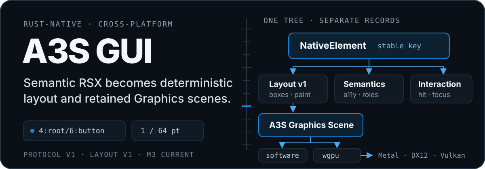
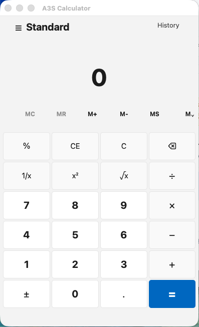

<p align="center">
  
</p>

<p align="center">
  <a href="https://github.com/A3S-Lab/GUI/actions/workflows/ci.yml"></a>
  
  
  
  <a href="LICENSE"></a>
</p>

**A3S GUI** is a Rust-native, cross-platform semantic UI and rendering runtime.
Rust RSX is available today; a planned `@a3s/gui` automatic JSX runtime will
let standard TSX executed by Node or Nub feed the same native pipeline. Neither
path uses a DOM, CSSOM, WebView, or framework-owned content renderer.

> [!IMPORTANT]
> The repository is in its P0 renderer migration. The semantic runtime and
> AppKit/GTK4/WinUI control hosts are established dogfood baselines. The first
> generic self-drawn layout-to-Scene slice has landed; self-drawn text, input,
> IME, accessibility bridges, and real thin-host presentation remain roadmap
> work. The TSX runtime, local host session, and npm packages are architecture
> only and have not been implemented yet.

The target is unambiguous: A3S draws all application content. The existing
`appkit-native`, `gtk4-native`, and `winui-native` modules create controls only
as frozen migration baselines. The final macOS host keeps AppKit only for the
application/window shell, one custom Metal-backed view, input, IME,
accessibility, and explicit system services. The final Linux host uses
Wayland/X11 without GTK4; the final Windows host uses Win32 without WinUI or
XAML. See the [self-drawn platform host plan](docs/platform-hosts.md).

## One tree, measured end to end

<p align="center">
  
</p>

<p align="center"><sub>The shared calculator on a native-control migration host. The same state, reducers, RSX components, window constraints, and Native IR now drive the generic rectangle layout/Scene fixture.</sub></p>

The calculator is the first fixed renderer proof at `410 × 620` logical
pixels. The fixture does not introduce a calculator-only visual model.

| Gate | Checked evidence |
| --- | --- |
| Input | The existing calculator RSX lowers through `RsxCompilerBridge` into the real window-wrapped `NativeElement` tree |
| Field ownership | All 504 top-level `PortableStyle` fields, every `NativeRole`, and every normalized event kind have executable milestone assignments |
| Layout | Schema v1, 1/64-point quantization, stable keyed records, separate hit regions, and fingerprint `16529597026056060935` |
| Scene | Stable layout paths derive retained `DrawId` values and scene fingerprint `2100550662756266801` |
| Software | Repeated reference output is byte-identical; an unchanged second frame produces no retained damage |
| GPU | Local Direct3D 12 readback passed the reviewed non-text gate: 0.370% differing edge pixels, maximum channel delta 91 |

The GPU result is local DX12 evidence, not a Metal/Vulkan parity claim. Text and
real self-drawn window presentation are not represented by the screenshot
above.

## TSX to native, without a browser

The proposed TypeScript path follows
[Nub](https://github.com/nubjs/nub)'s strongest runtime idea: keep stock Node,
transform `.tsx` through its normal loader pipeline, and let a narrow Rust
boundary own native work. A3S adds a standard automatic JSX runtime and a
supervised native host; it does not fork Nub or add another TSX compiler.

```text
app.tsx -> Nub / Node -> @a3s/gui/jsx-runtime -> versioned UI frame
                                                    |
                                                    v
                                           Rust native host
                                                    |
                         NativeElement -> layout -> Graphics -> OS window
                                                    |
                                                    v
                                  ordered actions -> TypeScript callbacks
```

The intended API is ordinary TSX:

```tsx
import { Button, Text, View, Window, createApp, useState } from "@a3s/gui";

function Counter() {
  const [count, setCount] = useState(0);
  return (
    <Window title="Counter" width={360} height={220}>
      <View className="flex-col gap-4 p-6">
        <Text>Count: {count}</Text>
        <Button onPress={() => setCount((value) => value + 1)}>Increment</Button>
      </View>
    </Window>
  );
}

await createApp(Counter).run();
```

This sample documents the target API; it is not runnable yet. The proposed
design keeps component state and callbacks in Node, keeps platform/GPU handles
inside a separate Rust process, reuses resolved `ProtocolUiFrameV1` records,
and sends complete frames so Rust remains the only native reconciler. Read the
[TSX native runtime architecture](docs/tsx-native-runtime.md) for protocol,
identity, failure recovery, packaging, and T0-T5 delivery gates.

## Quick start: Rust RSX today

The crate is currently consumed from Git:

```toml
[dependencies]
a3s-gui = { git = "https://github.com/A3S-Lab/GUI" }
```

Define state, register a reducer, and return semantic RSX:

```rust
use a3s_gui::{rsx, ComponentCx, GuiResult, RSX};

#[derive(Default)]
struct CounterState {
    count: u32,
}

fn counter(cx: &mut ComponentCx<CounterState>) -> RSX {
    let count = cx.use_state("count", |state: &CounterState| state.count);
    let increment = cx.use_reducer("increment", |state: &mut CounterState, _| {
        state.count += 1;
        Ok(())
    });

    rsx!(
        <Button key="increment" onPress={increment}>
          Count {count}
        </Button>
    )
}

fn main() -> GuiResult<()> {
    let component = ComponentCx::compile("counter", counter)?;
    let frame = component.render(&CounterState::default())?;
    println!("{} action(s)", frame.actions.len());
    Ok(())
}
```

From this repository, run the headless component atlas:

```sh
cargo run --locked --example component_playground
```

Or open the native atlas for the current operating system:

```sh
just playground
```

## Architecture

```text
Rust ComponentCx / .rsx          planned TSX in Node / Nub
            |                              |
            |                     @a3s/gui/jsx-runtime
            |                              |
            +--------------+---------------+
                           |
                           v
                resolved versioned UI frame
                           |
                           v
                   NativeElement tree
                  /         |          \
                 v          v           v
       LayoutSnapshot   semantics   interaction + hit regions
                 |      + a11y
                 v
         A3S Graphics Scene
                 |
                 v
       FramePlanner -> software reference / wgpu
                            /          |          \
                           v           v           v
                        Metal        DX12       Vulkan
                           |           |           |
                           v           v           v
                  macOS OS shell    Win32    Wayland / X11
                           \           |           /
                            +----------+----------+
                                       |
                      normalized events -> Rust reducers
                                 or TSX callbacks
```

These products share stable element identity, but they stay separate. Paint
commands never become the accessibility tree, and Graphics never infers an
action from a colored rectangle.

| Layer | Owns | Does not own |
| --- | --- | --- |
| Authoring and design system | Rust components and RSX today; planned Node-owned TSX components and hooks; typed props, contracts, variants, and tokens | GPU resources, native handles, layout truth, product workflows inside GUI core |
| Semantic runtime | `NativeElement`, reducers, actions, interaction, focus, selection, overlays, i18n, capabilities, and accessibility | Graphics devices, toolkit state, product I/O |
| Layout and scene adapter | Portable style resolution, quantized boxes, paint extraction, hit regions, diffs, and diagnostics | Product state, OS widget geometry, backend-specific GPU calls |
| [A3S Graphics](https://github.com/A3S-Lab/Graphics) | Scene schema, stable draw identity, retained damage, preparation, software rasterization, shaders, and GPU rendering | RSX, widgets, accessibility, IME, windows |
| Platform host | Windows, event loop, raw input, IME, accessibility bridge, clipboard, system surfaces, and presentation | Component layout, style interpretation, application-content drawing |

`layout` remains available in semantic-only builds. Scene extraction is gated
by `graphics`; the deterministic reference renderer and GPU renderer are gated
independently.

## What exists today

### Authoring and runtime

- `ComponentCx` function components with state, props, context, memoized and
  derived values, effects, resources, references, reducers, and interaction
  hooks
- static RSX lowering for semantic components, intrinsic elements, actions,
  bindings, fragments, slots, and spreads
- stable semantic identity and ordered prepare/commit/ACK transactions with
  rollback, degraded-state recovery, replay, and sensitive-value redaction
- a broad built-in `rsx_ui` registry covering foundations, forms, collections,
  overlays, date/time, color, feedback, routing, and drag/drop semantics

### Interaction and accessibility

- normalized keyboard, mouse, touch, pen, wheel, focus, hover, press,
  long-press, and move lifecycles
- keyed focus and interaction state, collection navigation, selection models,
  overlay dismissal/containment, and logical LTR/RTL placement
- ICU4X-backed locale, collation, date/number formatting, decimal/percent
  parsing, localized stepping, and NumberField announcements
- portable accessibility trees, conformance checks, relationships, state,
  structure, live regions, announcements, and field-level capability reports

### Layout and owned pixels

- collision-safe path identities derived from stable sibling keys
- versioned `LayoutSnapshot` records with quantized border/content boxes,
  clips, z/order, paint, structured diagnostics, stable diffs, and hit regions
- calculator-grade block and no-wrap row/column flow, box model, constrained
  size, alignment, positioning, overflow clipping, opacity, backgrounds,
  per-edge borders, and circular radii
- `NativeElement -> LayoutSnapshot -> Graphics Scene` lowering with stable
  draw IDs and rejection of error-level projection gaps
- deterministic retained software rendering and an owned `wgpu` renderer
  boundary with asynchronous readback

## Roadmap at a glance

| Milestone | State | Evidence or next gate |
| --- | --- | --- |
| M0 · Graphics boundary | Complete | Versioned scene, validation, fingerprints, retained damage, and deterministic reference core |
| M1 · GUI integration | Complete | Pinned Graphics boundary, semantic-only dependency gate, renderer inventory, reference/GPU wrappers, first generic adapter |
| M2 · GPU backend | Implementation landed | Graphics commit `8748fab`; Metal and Vulkan CI parity evidence remains |
| M3 · Layout and Scene | Current | Generic calculator rectangle slice landed; full flex, stacking, redraw scheduling, cross-platform fingerprints, and thin-host presentation remain |
| M4 · Text and interaction cutover | Planned | Shaping, glyphs, GUI-owned input, IME, accessibility bridges, overlays, and complete calculator scenarios |
| M5 · Default cutover | Planned | Make self-drawn content the default, then delete the three legacy widget renderers |
| H0-H5 · Thin platform hosts | Planned | Zero-widget host contract, shared window runtime, Win32/macOS/Wayland-X11 slices, and dependency-audited cutover |
| T0-T5 · TSX native authoring | Proposed | Automatic JSX runtime, versioned Node-to-host session, state/event runtime, self-drawn native window, packages, and stable SDK |

The dependency-ordered plan and acceptance gates are in the
[delivery roadmap](docs/roadmap.md).

## Cargo features

The default set is `headless + authoring + design-system + software-reference`.

| Feature | Purpose |
| --- | --- |
| `headless` | Deterministic runtime and host behavior without an OS GUI |
| `graphics` | Pinned A3S Graphics scene vocabulary without a renderer backend |
| `software-reference` | Deterministic retained reference renderer; implies `graphics` |
| `gpu` | Owned offscreen GPU renderer and readback path; implies `graphics` |
| `authoring` | SWC-backed RSX parsing, `ComponentCx`, and explicit component registries |
| `design-system` | Built-in `rsx_ui` registry; implies `authoring` |
| `appkit`, `gtk4`, `winui` | Legacy planning adapters retained for migration evidence |
| `appkit-native` | Legacy AppKit control surface on macOS |
| `gtk4-native` | Legacy GTK4 control surface on Linux 4.14+ |
| `winui-native` | Legacy WinUI 3 control surface on Windows |

The runtime core can stay independent of authoring and Graphics:

```sh
cargo check --locked --no-default-features --lib
cargo check --locked --no-default-features --features authoring --lib
cargo check --locked --no-default-features --features graphics --lib
cargo check --locked --no-default-features --features software-reference --lib
cargo check --locked --no-default-features --features gpu --lib
```

## Platform hosts: migration baseline and target

The currently executable native features are migration evidence, not the
renderer destination:

| Host | Current feature | Current role |
| --- | --- | --- |
| Headless | default `headless` | Protocol tests, reducer flow, command inspection, capability audits, accessibility snapshots, and reference rendering |
| macOS | `appkit-native` | AppKit dogfood/smoke baseline for controls, input, focus, menus, overlays, and accessibility |
| Linux | `gtk4-native` | GTK4 dogfood/smoke baseline for controls, input, focus, menus, dialogs, scrolling, and accessibility |
| Windows | `winui-native` | WinUI 3 dogfood/smoke baseline for controls, input, focus, dialogs, overlays, and accessibility |

The native surfaces are useful for project dogfood and focused smoke evidence;
they are not presented as a stable production application framework. Their
application-content widgets remain frozen migration code and will be removed
only after the self-drawn cutover gates pass.

The target hosts expose one top-level window/surface plus OS services. They do
not receive widget create/update/remove commands:

| Host | Target shell and presentation | Forbidden content path |
| --- | --- | --- |
| macOS | AppKit lifecycle, `NSWindow`, one custom `NSView`/`CAMetalLayer`, Metal | AppKit buttons, fields, stacks, or toolkit layout |
| Linux | Wayland + `xdg-shell`, separately gated X11 fallback, Vulkan | GTK4, GDK, GSK, or GTK controls |
| Windows | Win32 `HWND`/message loop, DX12/DXGI presentation | WinUI 3, XAML, or WinUI controls |

Input, IME, accessibility, clipboard, file pickers, permission prompts, and
native window chrome remain OS integration. Layout, text, forms, menus,
popovers, ordinary dialogs, hit testing, and every application-content pixel
remain A3S-owned. The dependency firewall, H0-H5 milestones, and platform
acceptance matrix are specified in the
[platform host architecture](docs/platform-hosts.md).

## Examples

Headless and protocol examples:

```sh
cargo run --locked --example protocol_session
cargo run --locked --example state_loop
cargo run --locked --example native_runtime_app
cargo run --locked --example dogfood_session
cargo run --locked --example component_playground
```

Host-selecting recipes:

```sh
just controls-native
just calculator
just playground
just dogfood-native
```

Direct native entrypoints follow the same pattern:

```sh
# Replace <backend> with appkit, gtk4, or winui on the matching host.
cargo run --locked --features <backend>-native --example <backend>_controls
cargo run --locked --features <backend>-native --example <backend>_calculator
cargo run --locked --features <backend>-native --example <backend>_component_playground
cargo run --locked --features <backend>-native --example <backend>_dogfood
```

## Development

The repository pins Rust 1.95.0 and commits `Cargo.lock`. Run commands from the
crate root.

```sh
# Portable formatting, dependency boundaries, lint, docs, tests, adapters,
# Graphics paths, examples, and whitespace.
just verify

# Matching host-native library tests and all-target compile check.
just native-ci
```

Native input evidence is generated and verified independently:

```sh
just native-input-manifest winui
just native-input-conformance path/to/native-evidence.json
just winui-input-smoke path/to/winui-smoke.json
```

The WinUI smoke runner requires an interactive Windows desktop and Windows App
Runtime 1.7. AppKit and GTK4 native checks require their matching host
toolchains; GTK4 requires 4.14 or newer development libraries.

<details>
<summary><strong>Repository map</strong></summary>

```text
src/
|- accessibility/       semantic tree, conformance, and native-ready values
|- app/ + runtime/       reducer loop, interaction, focus, overlays, and effects
|- compiler.rs           structured RSX to compiled semantic nodes
|- rsx_app/              ComponentCx, hooks, components, and binding scope
|- rsx_ui/               built-in semantic design-system registry
|- protocol.rs           versioned frame, event, action, ACK, and recovery boundary
|- native.rs             portable NativeElement UI IR
|- layout/               deterministic records, style projection, diffs, and tests
|- drawing.rs            Graphics boundary and reference/GPU renderer wrappers
|- drawing/layout_scene.rs
|                        LayoutSnapshot to Graphics Scene lowering
|- render_contract.rs    executable field/role/event milestone inventory
|- platform_host/        planned zero-widget OS shell and presentation boundary
|- backend/ + platform/  legacy execution/planning migration baseline
`- *_native/             AppKit, GTK4, and WinUI control hosts during migration

examples/                headless, calculator, dogfood, controls, and playground apps
docs/                    architecture, contracts, packaging, language, and roadmap
packaging/               unsigned native smoke-bundle assets and validators
```

</details>

## Documentation

- [Architecture and ownership boundaries](docs/architecture.md)
- [Layout and Graphics Scene contract](docs/layout-scene.md)
- [Renderer field inventory](docs/renderer-field-inventory.md)
- [Self-drawn platform host architecture](docs/platform-hosts.md)
- [RSX language and hooks](docs/rsx.md)
- [RSX framework plan](docs/rsx-framework.md)
- [TSX to native runtime architecture](docs/tsx-native-runtime.md)
- [Native style contract](docs/style-contract.md)
- [React Aria native direction](docs/react-aria-native.md)
- [Native app shell](docs/app-shell.md)
- [Native packaging](docs/packaging.md)
- [Delivery roadmap](docs/roadmap.md)

## License

[MIT](LICENSE)
